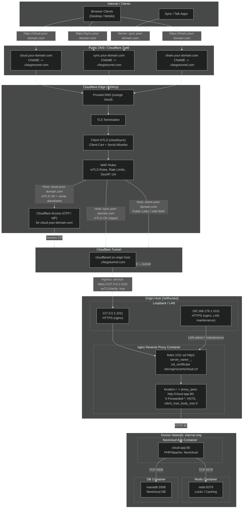

### End-to-End Request Flow  
#### From Public Internet through Cloudflare Zero Trust to Dockerized Nextcloud

The diagram below shows the full path of a request from browser or sync app on the public Internet,
through Cloudflare (proxied DNS, TLS, mTLS, WAF, Access) and the egress-only Cloudflare Tunnel,
down to the local nginx reverse proxy on `127.0.0.1:1011` / `192.168.178.1:1011` and finally into the
internal Docker network where the Nextcloud app, Redis and the database run. Each hop represents a
separate trust and control layer in the overall Zero-Trust design.

