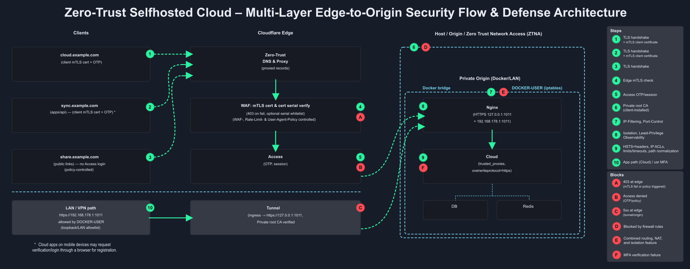
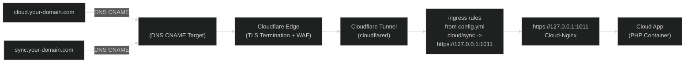

# Zero-Trust Selfhosted Cloud – Multi-Layer Edge-to-Origin Security Flow & Defense Architecture

A practical, reproducible **Zero-Trust** pattern for a **self-hosted Cloud** behind **Cloudflare**. Traffic is forced through **proxied DNS**, **mTLS at the edge**, **Cloudflare Access** (OTP/session), and an **egress-only Cloudflare Tunnel** to an origin where **Nginx** front-ends the Cloud in **Docker** with **explicit trust anchors** and **micro-segmented backends**.

---
<p align="center">
  <a href="#architecture-overview">
    
  </a>
  <a href="#core-benefits-osi--defense-in-depth">
    
  </a>
  <a href="#environment">
    
  </a>
  <a href="#clean-runbook-step-by-step">
    
  </a>
  <a href="docs/zerotrust_flow_anonymized_v4.svg">
    
  </a>
  <a href="#security-notes--best-practices">
    
  </a>
</p>

---

## Table of Contents
- [Architecture Overview](#architecture-overview)
- [Core Benefits (OSI × Defense-in-Depth)](#core-benefits-osi--defense-in-depth)
- [Environment](#environment)
- [Clean Runbook (Step-by-Step)](#clean-runbook-step-by-step)
- [Verification & Tests](#verification--tests)
- [Security Notes & Best Practices](#security-notes--best-practices)
- [Appendix: Example Cloudflare mTLS WAF Rules](#appendix-example-cloudflare-mtls-waf-rules)

---

<p align="center">
  
</p>

---

## Architecture Overview

**Clients → Cloudflare Edge → Cloudflare Tunnel → Nginx → Cloud → (Redis, DB, etc.)**

- **Browser flow**: `cloud.your-domain.com` → Edge **mTLS** → **Access (OTP)** → **Tunnel** → Nginx → user MFA → Cloud.  
- **Sync apps**: `sync.your-domain.com` → Edge mTLS → (optional Access / policy) → Tunnel → Nginx → user MFA / app-token → Cloud.  
- **Public shares**: `share.your-domain.com` → Edge bypass/mild policy → Tunnel → Nginx → Cloud (public links).  
- **LAN maintenance**: `https://192.168.178.1:1011` → client root CA → Nginx → user MFA → Cloud (LAN allowlisted via `DOCKER-USER`).

Origin exposure is eliminated: **no inbound ports** on the host, **deny-by-default** at every hop.

---

## Core Benefits (OSI × Defense-in-Depth)

- **Edge-only perimeter (L7)** — origin IP hidden; proxied DNS enforces single choke point.  
- **Device identity first (L5/L6 TLS with mTLS)** — **proof-of-possession** before app contact; optional **serial allowlist**.  
- **User identity & context (L7 Access)** — OTP/MFA, IdP groups, posture/WARP; **no session ⇒ no tunnel**.  
- **Egress-only path (L3/L4)** — Cloudflare Tunnel to **`https://127.0.0.1:1011`** on the origin; fail-closed if tunnel drops.  
- **Reverse-proxy boundary (L7)** — Nginx isolates the app, sets `X-Forwarded-*`, HSTS, limits/timeouts.  
- **Explicit app trust (L7)** — Cloud `trusted_proxies`, `trusted_domains`, `overwriteprotocol=https`.  
- **Micro-segmented backends (L4–L7)** — Redis/DB/... on private Docker network; least-privilege communication only.

---

## Environment

- **DNS & Proxy:** Managed in Cloudflare; records **proxied** (orange cloud).  
- **Hostnames:**  
  - `cloud.your-domain.com` (browser / UI),  
  - `sync.your-domain.com` (apps / sync),  
  - `share.your-domain.com` (public links).  
- **Origin:** Dockerized Cloud behind **Nginx** bound to  
  - **`127.0.0.1:1011`** (loopback, used by the Tunnel), and  
  - optionally **`192.168.178.1:1011`** (LAN maintenance / direct admin access).  
- **Tunnel:** Cloudflare Tunnel with ingress → `https://127.0.0.1:1011` (internal only, `noTLSVerify: true`).

> Replace `your-domain.com` with your domain (e.g., `example.com`).


```mermaid
%%{init: {'theme': 'dark'}}%%
flowchart LR
    C1["cloud.your-domain.com"]
    C2["sync.your-domain.com"]

    CNAME["<tunnel-id><br>(DNS CNAME Target)"]
    EDGE["Cloudflare Edge<br>(TLS Termination + WAF)"]
    TUNNEL["Cloudflare Tunnel<br>(cloudflared)"]
    INGRESS["ingress rules<br>from config.yml<br>cloud/sync -><br>https://127.0.0.1:1011"]
    ORIGIN["https://127.0.0.1:1011<br>Cloud-Nginx"]
    APP["Cloud App<br>(PHP Container)"]

    C1 -->|DNS CNAME| CNAME
    C2 -->|DNS CNAME| CNAME

    CNAME --> EDGE
    EDGE --> TUNNEL
    TUNNEL --> INGRESS
    INGRESS --> ORIGIN
    ORIGIN --> APP
```

---

## Clean Runbook (Step-by-Step)

### A. Cloudflare Zone & DNS

1. **Create/Import Zone** in Cloudflare; verify NS setup at registrar.  
2. **Add DNS records** for `cloud`, `sync`, `share` → **proxied** (orange cloud, CNAME or A/AAAA).  
3. **(Optional)** Keep `@`/`www` DNS-only if you host a separate landing page.

### B. Cloudflare Tunnel

4. **Install `cloudflared`** (package or Docker) on the origin host.  
5. **Authenticate**: `cloudflared tunnel login` → create tunnel (e.g., `cloud`).  
6. **Configure** `/etc/cloudflared/config.yml` (or mounted file) with ingress:

   ```yaml
   tunnel: cloud
   credentials-file: /etc/cloudflared/<TUNNEL_ID>.json

   ingress:
     - hostname: cloud.your-domain.com
       service: https://127.0.0.1:1011
       originRequest:
         noTLSVerify: true

     - hostname: sync.your-domain.com
       service: https://127.0.0.1:1011
       originRequest:
         noTLSVerify: true

     - hostname: share.your-domain.com
       service: https://127.0.0.1:1011
       originRequest:
         noTLSVerify: true

     # Fallback for everything else:
     - service: http_status:404
   ```

7. **Route DNS to tunnel** (Cloudflare dashboard or `cloudflared tunnel route dns …`).  
8. **Run as service** (`cloudflared service install` or Docker `restart: unless-stopped`).

### C. Origin Nginx (Reverse Proxy)

9. **Bind ports to loopback and LAN only** (example):

   - `127.0.0.1:1011` (used by the Cloudflare Tunnel)  
   - `192.168.178.1:1011` (optional LAN/maintenance access)

10. Example Nginx server block:

   ```nginx
   server {
     listen 1011 ssl;
     http2 on;
     server_name _;

     ssl_certificate     /etc/nginx/certs/cloud.crt;
     ssl_certificate_key /etc/nginx/certs/cloud.key;

     # Optional: HSTS if you are sure all clients use HTTPS
     add_header Strict-Transport-Security "max-age=15768000; includeSubDomains; preload" always;

     # Route everything to the PHP app container
     location / {
       proxy_pass http://cloud-app:80;
       proxy_http_version 1.1;

       proxy_set_header Host              $http_host;
       proxy_set_header X-Real-IP         $remote_addr;
       proxy_set_header X-Forwarded-For   $proxy_add_x_forwarded_for;
       proxy_set_header X-Forwarded-Proto $scheme;
       proxy_set_header X-Forwarded-Host  $host;
       proxy_set_header X-Forwarded-Port  $server_port;

       proxy_redirect off;
       client_max_body_size 0;
     }
   }
   ```

11. **Firewall (DOCKER-USER)** — allow loopback and LAN, drop others:

   ```bash
   # Allow local loopback (cloudflared → nginx on 127.0.0.1:1011)
   sudo iptables -I DOCKER-USER -i lo -p tcp --dport 1011 -j ACCEPT

   # Allow LAN subnet (replace 192.168.178.0/24 with your LAN)
   sudo iptables -I DOCKER-USER -s 192.168.178.0/24 -p tcp --dport 1011 -j ACCEPT

   # Drop everything else to port 1011
   sudo iptables -A DOCKER-USER -p tcp --dport 1011 -j DROP
   ```

### D. Cloud Hardening

12. **Trusted domains** (inside the PHP/Cloud container, as `www-data`):

   ```bash
   php occ config:system:set trusted_domains 0 --value=cloud.your-domain.com
   php occ config:system:set trusted_domains 1 --value=sync.your-domain.com
   php occ config:system:set trusted_domains 2 --value=192.168.178.1
   php occ config:system:set trusted_domains 3 --value=192.168.178.1:1011
   php occ config:system:set trusted_domains 4 --value=127.0.0.1
   ```

13. **Trusted proxy & forwarding headers**:

   ```bash
   php occ config:system:set trusted_proxies 0 --value=<nginx_container_ip>
   php occ config:system:set trusted_proxies 1 --value=192.168.178.1

   php occ config:system:set forwarded_for_headers 0 --value=HTTP_CF_CONNECTING_IP
   php occ config:system:set forwarded_for_headers 1 --value=HTTP_X_FORWARDED_FOR

   php occ config:system:set overwriteprotocol --value=https
   ```

### E. Cloudflare Access & mTLS

14. **mTLS** — enable **Client Certificates Required** for `cloud.your-domain.com`.  
15. **Client CA** — use Cloudflare’s Client CA or upload your own.  
16. **Serial allowlist** via WAF rule (see Appendix).  
17. **Access Application (Self-hosted)** for `cloud.your-domain.com`:

    - **Login methods:** OTP and/or your IdP.  
    - **Session duration:** as needed (e.g. 8–24h).  
    - **Cookies:** HTTPOnly; SameSite=Lax/Strict; optionally binding to device/posture.

18. **Bypass policy** (or dedicated Access app) for `sync.your-domain.com` (apps), gated by device/WARP/mTLS as desired.  
19. **Mild policy** for `share.your-domain.com` (public links).

### F. Health & Observability

20. **`cloudflared` status/logs** on the host; **Zero Trust → Logs** for Access/mTLS decisions.  
21. **Nginx** `nginx -t` and logs; Cloud logs for trusted domain/proxy issues.

---

## Verification & Tests

- **mTLS block (no client cert):**

  ```bash
  curl -Ik https://cloud.your-domain.com
  # Expect: 403 at edge (no valid client cert)
  ```

- **mTLS pass + Access redirect (with P12):**

  ```bash
  curl -Ik --cert client.p12 --cert-type P12 --pass "<p12_password>" https://cloud.your-domain.com
  # Expect: 302 → /cdn-cgi/access/login/...
  ```

- **LAN path (no Cloudflare):**

  ```bash
  curl -Ik https://192.168.178.1:1011/
  # Expect: 302 → /login (or your app's login page)
  ```

- **Sync path (apps):**  
  App connects to `https://sync.your-domain.com` under your policy (mTLS/device posture/WAF), then Tunnel → Nginx → Cloud.

---

## Security Notes & Best Practices

- **Deny-by-default everywhere**; each hop verifies explicitly.  
- **No inbound origin ports**; egress-only Tunnel should **fail-closed**.  
- **One device, one cert**; consider non-exportable keys (TPM/Keychain) for high-sensitivity clients.  
- **Whitelist Issuer + Serial** if you use serial filters; rotate on renewal.  
- **Keep Cloud trust anchors tight**; monitor audit logs and header configuration.  
- Separate **backup/restore paths** from runtime network to avoid lateral movement.

---

## Appendix: Example Cloudflare mTLS WAF Rules

> All examples assume the **rule action = Block**.  
> A request is blocked if the expression evaluates to `true`.

---

### 1. Minimal: Require any valid (non-revoked) mTLS client certificate

Blocks every request to `cloud.your-domain.com` that **does not** present a valid, non-revoked client certificate.

**Block if:**

- Host is `cloud.your-domain.com`, **and**  
- EITHER no valid client cert is present **or** the cert is revoked.

Effectively: **Only requests with a verified AND non-revoked client cert are allowed through.**

```txt
(http.host eq "cloud.your-domain.com"
 and (
   not cf.tls_client_auth.cert_verified
   or cf.tls_client_auth.cert_revoked
 )
)
```

---

### 2. Allowlist by serial

Block if the request does **not** match the “allowed mTLS client” condition below.

Allowed mTLS client condition (inside the `not ( … )`):

- `cert_verified = true`
- `cert_revoked = false`
- `cert_serial` (lowercased) is in the allowlist set

```txt
(http.host eq "cloud.your-domain.com"
 and not (
   cf.tls_client_auth.cert_verified
   and not cf.tls_client_auth.cert_revoked
   and lower(cf.tls_client_auth.cert_serial) in {
     "123456789123456789123456789"
     "123456789123456789123456789"
   }
 )
)
```

---

### 3. Allowlist by issuer + serial (safer)

Block if the request does **not** match the “allowed mTLS client from correct CA” condition.

Allowed mTLS client from correct CA condition:

- `cert_verified = true`
- `cert_revoked = false`
- `cert_issuer_dn` (lowercased) contains an identifying substring of your CA
- `cert_serial` (lowercased) is in the allowlist set

Replace:

- `"your client ca name"` with a distinctive part of your CA’s issuer DN  
- the serials below with your real lowercased serial numbers

```txt
(http.host eq "cloud.your-domain.com"
 and not (
   cf.tls_client_auth.cert_verified
   and not cf.tls_client_auth.cert_revoked
   and lower(cf.tls_client_auth.cert_issuer_dn) contains "your client ca name"
   and lower(cf.tls_client_auth.cert_serial) in {
     "123456789123456789123456789"
     "123456789123456789123456789"
   }
 )
)
```