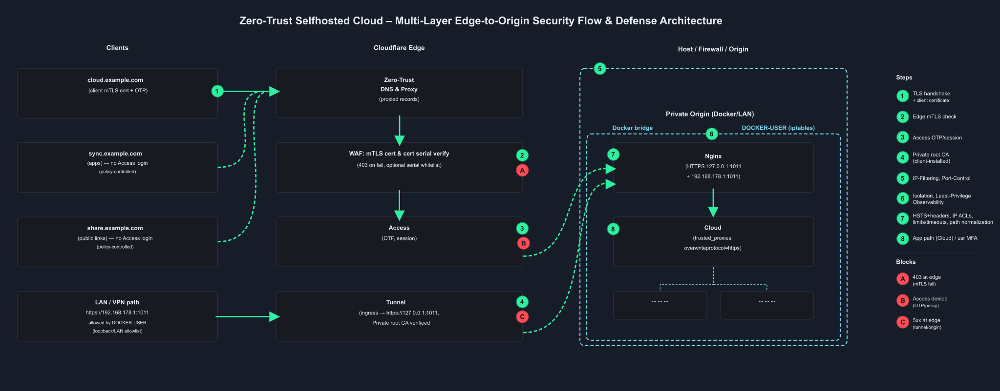

# Zero-Trust Selfhosted Cloud – Multi-Layer Edge-to-Origin Security Flow & Defense Architecture

A practical, reproducible **Zero‑Trust** pattern for **self-hosted Cloud** behind **Cloudflare**. Traffic is forced through **proxied DNS**, **mTLS at the edge**, **Cloudflare Access** (OTP/session), and an **egress‑only Cloudflare Tunnel** to an origin where **Nginx** front-ends Cloud in **Docker** with **explicit trust anchors** and **micro‑segmented backends**.

---

## Table of Contents
- [Architecture Overview](#architecture-overview)
- [Core Benefits (OSI × Defense-in-Depth)](#core-benefits-osi--defense-in-depth)
- [Environment & Assumptions](#environment--assumptions)
- [Clean Runbook (Step-by-Step)](#clean-runbook-step-by-step)
- [Verification & Tests](#verification--tests)
- [Security Notes & Best Practices](#security-notes--best-practices)
- [Appendix: Example Cloudflare Rules](#appendix-example-cloudflare-rules)

---

<p align="center">
  
</p>

---

## Architecture Overview

**Clients → Cloudflare Edge → Cloudflare Tunnel → Nginx → Cloud → (Redis, DB, etc)**

- **Browser flow**: `cloud.example.com` → Edge **mTLS** → **Access (OTP)** → **Tunnel** → Nginx → Cloud.  
- **Sync apps**: `sync.example.com` → Edge mTLS → **bypass Access** (policy-controlled) → Tunnel → Nginx → Cloud.  
- **Public shares**: `share.example.com` → Edge bypass/mild policy → Tunnel → Nginx → Ccloud.  
- **LAN maintenance**: `https://192.168.178.1:1011` → Nginx → Cloud (allowlisted via `DOCKER-USER`).

Origin exposure is eliminated: **no inbound ports** on the host, **deny-by-default** at every hop.

---

## Core Benefits (OSI × Defense-in-Depth)

- **Edge-only perimeter (L7)** — origin IP hidden; proxied DNS enforces single choke point.  
- **Device identity first (L5/L6 TLS with mTLS)** — **proof-of-possession** before app contact; optional **serial allowlist**.  
- **User identity & context (L7 Access)** — OTP/MFA, IdP groups, posture/WARP; **no session ⇒ no tunnel**.  
- **Egress-only path (L3/L4)** — Cloudflare Tunnel to **`https://127.0.0.1:1011`**; fail-closed if tunnel drops.  
- **Reverse-proxy boundary (L7)** — Nginx isolates the app, sets `X-Forwarded-*`, HSTS, limits/timeouts.  
- **Explicit app trust (L7)** — Cloud `trusted_proxies`, `trusted_domains`, `overwriteprotocol=https`.  
- **Micro-segmented backends (L4–L7)** — Redis/DB on private Docker network; least-privilege communication only.

---

## Environment & Assumptions

- **DNS & Proxy:** Managed in Cloudflare; records **proxied** (orange cloud).  
- **Hostnames:** `cloud.example.com` (browser), `sync.example.com` (apps), `share.example.com` (public links).  
- **Origin:** Dockerized Cloud behind **Nginx** bound to **`127.0.0.1:1011`** and (optionally) **`192.168.178.1:1011`** for LAN.  
- **Tunnel:** Cloudflare Tunnel with ingress → `https://127.0.0.1:1011` (internal only, `noTLSVerify: true`).

> Replace `example.com` with your domain (e.g., `sine-math.com`).

---

## Clean Runbook (Step-by-Step)

### A. Cloudflare Zone & DNS
1. **Create/Import Zone** in Cloudflare; verify NS setup at registrar.  
2. **Add A/AAAA/CNAME** for `cloud`, `sync`, `share` → **proxied** (orange cloud).  
3. **(Optional)** Keep `@`/`www` DNS-only if you host a separate landing page.

### B. Cloudflare Tunnel
4. **Install cloudflared** (package or Docker) on the origin host.  
5. **Authenticate**: `cloudflared tunnel login` → create tunnel (e.g., `cloud`).  
6. **Config** `/etc/cloudflared/config.yml` (or mounted file) with ingress:  
   ```yaml
   tunnel: cloud
   credentials-file: /etc/cloudflared/<TUNNEL_ID>.json
   ingress:
     - hostname: cloud.example.com
       service: https://127.0.0.1:1011
       originRequest: { noTLSVerify: true }
     - hostname: sync.example.com
       service: https://127.0.0.1:1011
       originRequest: { noTLSVerify: true }
     - hostname: share.example.com
       service: https://127.0.0.1:1011
       originRequest: { noTLSVerify: true }
     - service: http_status:404
   ```
7. **Route DNS to tunnel** (Cloudflare dashboard or `cloudflared tunnel route dns …`).  
8. **Run as service** (`cloudflared service install` or Docker `restart: unless-stopped`).

### C. Origin Nginx (Reverse Proxy)
9. **Bind ports** to **loopback** and **LAN** only: `127.0.0.1:1011`, `192.168.178.1:1011`.  
10. **TLS at Nginx** for local hop; set headers & security defaults:
    ```nginx
    server {
      listen 1011 ssl; http2 on;
      server_name _;
      ssl_certificate     /etc/nginx/certs/cloud.crt;
      ssl_certificate_key /etc/nginx/certs/cloud.key;
      add_header Strict-Transport-Security "max-age=15768000; includeSubDomains; preload" always;

      location / {
        proxy_pass http://cloud-app:80;
        proxy_set_header Host              $http_host;
        proxy_set_header X-Real-IP         $remote_addr;
        proxy_set_header X-Forwarded-For   $proxy_add_x_forwarded_for;
        proxy_set_header X-Forwarded-Proto $scheme;
        proxy_set_header X-Forwarded-Host  $host;
        proxy_set_header X-Forwarded-Port  $server_port;
        proxy_redirect off;
        client_max_body_size 0;
      }
    }
    ```
11. **Firewall (DOCKER-USER)** — allow **loopback** and **LAN**, drop others:
    ```bash
    sudo iptables -I DOCKER-USER -i lo -p tcp --dport 1011 -j ACCEPT
    sudo iptables -I DOCKER-USER -s 192.168.178.0/24 -p tcp --dport 1011 -j ACCEPT
    sudo iptables -A DOCKER-USER -p tcp --dport 1011 -j DROP
    ```

### D. Cloud Hardening
12. **Trusted domains** (inside the container, as `www-data`):
    ```bash
    php occ config:system:set trusted_domains 0 --value=cloud.example.com
    php occ config:system:set trusted_domains 1 --value=sync.example.com
    php occ config:system:set trusted_domains 2 --value=192.168.178.1
    php occ config:system:set trusted_domains 3 --value=192.168.178.1:1011
    ```
13. **Trusted proxy** (Nginx container IP & loopback) + headers:
    ```bash
    php occ config:system:set trusted_proxies 0 --value=<nginx_container_ip>
    php occ config:system:set trusted_proxies 1 --value=127.0.0.1
    php occ config:system:set forwarded_for_headers 0 --value=HTTP_CF_CONNECTING_IP
    php occ config:system:set forwarded_for_headers 1 --value=HTTP_X_FORWARDED_FOR
    php occ config:system:set overwriteprotocol --value=https
    ```

### E. Cloudflare Access & mTLS
14. **mTLS** — Enable **Client Certificates Required** for `cloud.example.com`.  
15. **Client CA** — Use Cloudflare’s client CA or upload your own.  
16. **Serial allowlist** via WAF rule (see Appendix).  
17. **Access Application (Self-hosted)** for `cloud.example.com`:
    - **Login methods:** OTP (or your IdP).  
    - **Session duration:** per policy.  
    - **Cookies:** HTTPOnly; SameSite=Lax/Strict; optionally binding cookie.  
18. **Bypass policy** for `sync.example.com` (apps), gated by device/WARP/mTLS as needed.  
19. **Mild policy** for `share.example.com` (public links).

### F. Health & Observability
20. **`cloudflared` status/logs** on the host; **Zero Trust → Logs** for Access/mTLS decisions.  
21. **Nginx** `nginx -t` and logs; **Cloud** logs for trusted domain/proxy issues.

---

## Verification & Tests

- **mTLS block (no client cert):**
  ```bash
  curl -Ik https://cloud.example.com
  # Expect: 403 at edge
  ```

- **mTLS pass + Access redirect (with P12):**
  ```bash
  curl -Ik --cert client.p12 --cert-type P12 --pass "<p12_password>" https://cloud.example.com
  # Expect: 302 → /cdn-cgi/access/login/...
  ```

- **LAN path (no Cloudflare):**
  ```bash
  curl -Ik https://192.168.178.1:1011/
  # Expect: 302 → /login
  ```

- **Sync path (bypass Access):**
  App connects to `https://sync.example.com` under your policy (mTLS/device posture), then Tunnel → Nginx → Cloud.

---

## Security Notes & Best Practices

- **Deny-by-default everywhere**; each hop verifies explicitly.  
- **No inbound origin ports**; egress-only Tunnel **fail-closed**.  
- **One device, one cert**; consider non-exportable keys (TPM/Keychain).  
- **Whitelist Issuer + Serial** if you use serial filters; rotate on renewal.  
- **Keep Cloud trust anchors tight**; watch audit logs and headers.  
- **Backups/restore paths** separated from runtime network.

---

## Appendix: Example Cloudflare Rules

**Block unless mTLS is verified & serial is allowlisted (optional serial clause):**
```txt
(http.host eq "cloud.example.com"
 and not (
   cf.tls_client_auth.cert_verified
   and lower(cf.tls_client_auth.cert_serial) in {"2810f59f687f3fc331d5fa169cf7ba7879342d73"}
  )
)
```

**Variant with Issuer check (safer):**
```txt
(http.host eq "cloud.example.com"
 and not (
   cf.tls_client_auth.cert_verified
   and lower(cf.tls_client_auth.cert_issuer_dn) contains "your client ca name"
   and lower(cf.tls_client_auth.cert_serial) in {"2810f59f687f3fc331d5fa169cf7ba7879342d73"}
  )
)
```

> Replace `example.com` accordingly; adjust the allowlist to your actual serial(s) and issuer.
