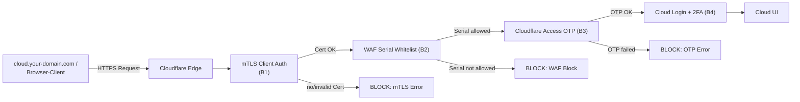
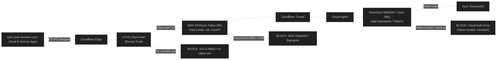
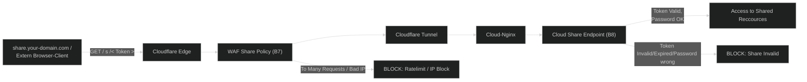

# Zero-Trust Policy Table – your-cloud-domain.com

## Overview

This table describes the zero-trust-oriented separation of the three main hosts:

- `cloud.your-domain.com` – Full browser access to the Nextcloud instance
- `sync.your-domain.com`  – Sync/API access for Nextcloud and Talk apps
- `share.your-domain.com` – Access to shared/public links (shares)

---

## Zero-Trust Policy Tabele

| Host                  | Purpose / Scope                              | Typical Clients                        | Cloudflare-Layer                                           | Cloud-Layer                                   | Zero-Trust-Benefit (short)                                                                 |
|-----------------------|--------------------------------------------|-----------------------------------------|------------------------------------------------------------|--------------------------------------------------------|--------------------------------------------------------------------------------------------|
| `cloud.your-domain.com` | Full access via browser                      | Browser (Desktop/Laptop)                | **mTLS Client-Cert** + WAF Serial-Whitelist + Access/OTP   | Login + **2FA** + Roles & Groups                     | Most privileged path, maximum hardening (mTLS → OTP → 2FA).                         |
| `sync.your-domain.com`  | **Sync + API** for Cloud, Messenger- & Service-Apps   | Cloud-Clients, Messenger, given. WebDAV    | TLS, WAF-Rules for App-Traffic (e. g. Path-/User-Agent-Focus, Rate-Limit, optional IP/Geo) | App passwords, device tokens, given. Restricted groups | Separation of UI & API: smaller scope, clearer policies for machine/app access.       |
| `share.your-domain.com` | **Public/semi-public shares**     | Browsers of external recipients         | TLS, WAF streng auf `/s/<token>` + Rate-Limits, no mTLS, no OTP, no Login-Flow        | Share tokens, expiration dates, optional share passwords   | Public scope isolated: Attacks on shares do not directly affect the `cloud.` login interface.

---

## cloud.yourdomain.com

- **B1 – mTLS Client Auth:** Only devices with a valid client certificate can reach the perimeter (device trust).
- **B2 – WAF Serial Whitelist:** Even if certificates are leaked, only a defined number of devices are allowed (least privilege/fine-grained device scope).
- **B3 – Cloudflare Access / OTP:** Additional identity/session security above the device certificate (user trust, protection against pure device copies).
- **B4 – Nextcloud Login + 2FA:** Third line of defense – user account remains protected even if certificate or OTP are compromised (account trust).

## sync.yourdomain.com

- **B5 – API/Sync WAF:**  
  Separation of UI and machine access; targeted limits and signatures for app traffic (paths, user agent, rate limits, geo/IP) instead of generic web rules.

- **B6 – App passwords & tokens:**  
  Device- and app-specific credentials, independent of the main login (scoped credentials, easy revocation of individual devices).

## share.yourdomain.com

- **B7 – Share WAF:** Strong focus on `/s/<token>` paths with hard rate limiting – reduces the risk of token brute force attacks and misuse of public links.
- **B8 – Isolated Share Scope:** Public access is logically separated from `cloud.your-domain.com` – attacks on shares do not directly affect the hardened login frontend.

---

### Zero-Trust Comparison: Registration Plane vs. Data/Sync Plane
>cloud.your-domain.com → Registration Plane (browser login, mTLS + OTP + 2FA)

>sync.your-domain.com → Data / Sync Plane (app/sync access with mTLS)
---
| Plane / Layer                | Host                  | Device Trust                                                                                                          | User / Account Trust                                                                                                             | Zero-Trust Meaning                                                                                                                                                                                                                  |
|-----------------------------|-----------------------|-----------------------------------------------------------------------------------------------------------------------|----------------------------------------------------------------------------------------------------------------------------------|-------------------------------------------------------------------------------------------------------------------------------------------------------------------------------------------------------------------------------------|
| **Registration Plane**      | `cloud.your-domain.com` | Enforced via **mTLS** (client certificates + serial allowlist).                                                      | **User trust:** Cloudflare Access / OTP **Account trust:** Nextcloud login + 2FA                                             | Only known, certificate-bound devices are allowed to issue new session / app tokens. Entry into the system is tightly bound to the specific device and user identity (strong registration perimeter).                                |
| **Data / Sync Plane (mTLS)**| `sync.your-domain.com`  | Also enforced via **mTLS** (client certificates + serial allowlist); every sync request is bound to a specific device. | **User / account trust:** App token (app password) **plus** WAF (rate limits, UA filters, geo/IP filters) as an additional layer. | Runtime access is both **token-bound** and **device-bound**. A compromised token alone is not sufficient – without the corresponding device certificate, the mTLS policy blocks access. This further reduces the per-account/per-device attack surface. |

---
